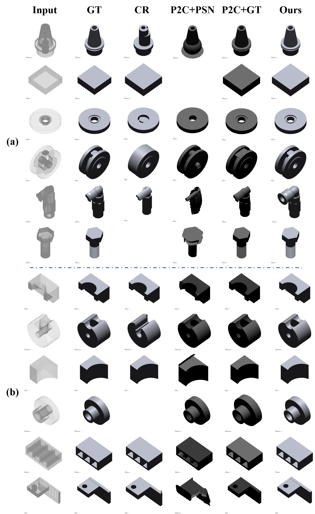
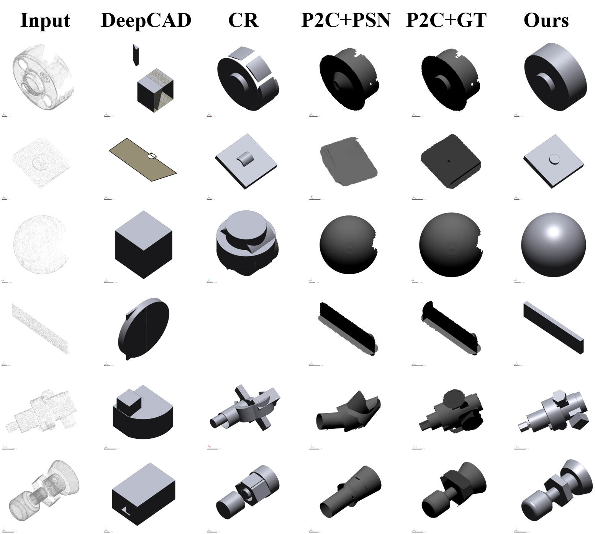

# RbRM: Robust B-Rep Reverse Modeling from Feature-Level Point-Cloud Instances to Manufacturing-Ready STEP Solids

 This repository is the official implementation of our paper: **"Robust B-Rep Reverse Modeling from Feature-Level Point-Cloud Instances to Manufacturing-Ready STEP Solids"** (Currently under review at *Advanced Engineering Informatics*).

## 🔔 Important Notice: Pre-release Version
Thank you for your interest in our work! Since the manuscript is currently under single-blind peer review, this repository serves as a **preview**. 

To protect the intellectual property of our core algorithms (including HFI, GGO, and SDA modules) during the review process, the full source code, compiled CloudCompare plugin, and pre-trained weights are **temporarily withheld**. 

**The complete codebase and end-to-end reproduction instructions will be made fully public immediately upon the paper's official acceptance.** ## 🚀 Key Highlights
Unlike existing methods that output unconstrained meshes or suffer from CAD kernel crashes, **RbRM** guarantees the generation of kernel-feasible, 100% watertight STEP solids from noisy and occluded 3D scans.
- **HFI:** Occlusion-Resilient Feature Inference.
- **GGO:** Global Geometric Optimization for design intent recovery.
- **SDA:** Semantic-Driven Assembly for robust Boolean operations.

## 🎥 Demo
Check out our early-stage prototype integrated into CloudCompare:
[
*(Note: This video demonstrates the base workflow. The latest robust Boolean and global optimization features evaluated in the paper have been significantly upgraded in our backend.)*

## 📊 Qualitative Results
Below are the visual comparisons on the public and real-world Scan dataset. Our method consistently avoids the non-manifold fragmented patches produced by existing generative baselines, outputting manufacturing-ready B-Reps.

, ---
*Stay tuned for updates! For academic inquiries, please feel free to contact the authors.*

### Acknowledgements

We would like to thank and acknowledge referenced codes from 

1. ParseNet: https://github.com/Hippogriff/parsenet-codebase.
2. ComplexGen: https://github.com/guohaoxiang/ComplexGen.
3. Point2CAD: https://github.com/prs-eth/point2cad.
4. DeepCAD: https://github.com/rundiwu/DeepCAD.
5. CAD-Recode: https://github.com/filaPro/cad-recode.
6. CADParser: https://drive.google.com/file/d/1CEgL22-dXunbmzAn5g2NetCwc1AFYiWk/view?usp=share_link
