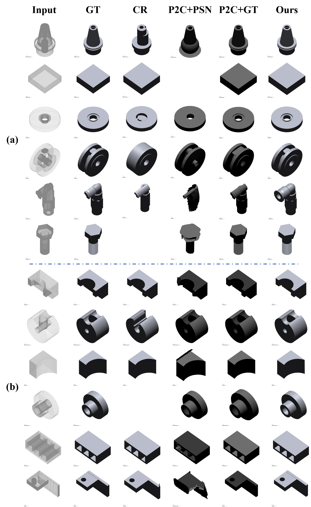
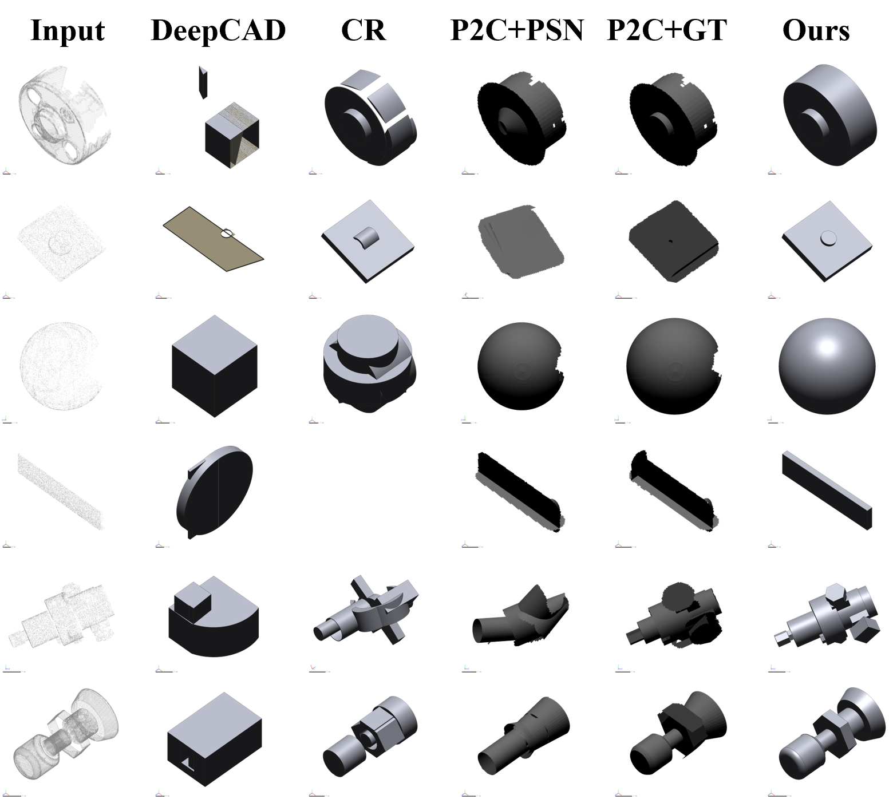

# RbRM: Robust B-Rep Reverse Modeling from Feature-Level Point-Cloud Instances to STEP-Compatible CAD Solids

This repository is the official implementation of our paper:

**"Robust B-Rep Reverse Modeling from Feature-Level Point-Cloud Instances to STEP-Compatible CAD Solids"**

(Currently under review at *Advanced Engineering Informatics*)

## 🔔 Important Notice: Pre-release Version

Thank you for your interest in our work!

Since the manuscript is currently under peer review, this repository provides a **preview version** of the RbRM framework.

To protect the intellectual property of the core reconstruction algorithms, including the HFI, GGO, and SDA modules, the complete reconstruction pipeline, and compiled CloudCompare plugin are **temporarily withheld**.

The complete codebase and end-to-end reproduction instructions will be released after the paper's official acceptance.

## 🚀 Key Highlights

RbRM is a feature-instance-guided backend reverse-modeling framework that reconstructs STEP-compatible B-Rep solids from structured engineering feature instances extracted from point clouds.

Unlike approaches that directly generate unconstrained surface representations, RbRM focuses on recovering engineering-level CAD structures through feature-aware reconstruction and CAD-kernel-compatible solid modeling.

- **HFI:** Occlusion-Resilient Feature Inference.
- **GGO:** Global Geometric Optimization for design intent recovery.
- **SDA:** Semantic-Driven Assembly for robust Boolean operations.

The framework integrates feature-level reasoning, geometric optimization, and CAD solid construction to improve reconstruction robustness under incomplete and noisy observations.

## 🎥 Demo

Check out our prototype demonstration:

[]

*(Note: This video demonstrates the overall workflow of the prototype. The backend reconstruction components have been further improved in the current paper version.)*

## 📊 Qualitative Results

Below are qualitative results on public CAD-derived benchmarks and real-world scan examples.

The results illustrate the capability of RbRM to reconstruct structured CAD solids while preserving engineering feature consistency and CAD-kernel compatibility.

,

---

Stay tuned for updates!

For academic inquiries, please feel free to contact the authors.

### Acknowledgements

We would like to thank and acknowledge referenced codes and datasets from:

1. ParseNet: https://github.com/Hippogriff/parsenet-codebase.
2. ComplexGen: https://github.com/guohaoxiang/ComplexGen.
3. Point2CAD: https://github.com/prs-eth/point2cad.
4. DeepCAD: https://github.com/rundiwu/DeepCAD.
5. CAD-Recode: https://github.com/filaPro/cad-recode.
6. CADParser: https://drive.google.com/file/d/1CEgL22-dXunbmzAn5g2NetCwc1AFYiWk/view?usp=share_link
